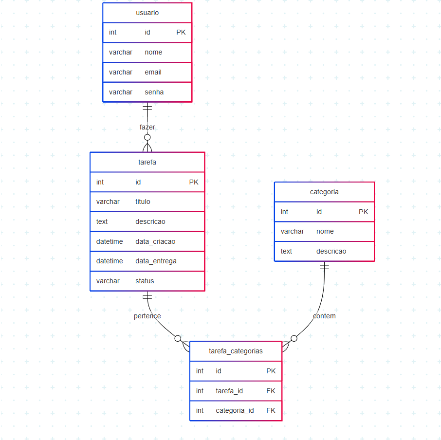

# 📋 Gerenciador de Tarefas

Um sistema completo de gerenciamento de tarefas com interface moderna, sistema de categorias e autenticação de usuários. Desenvolvido com Node.js, Express e PostgreSQL.



## ✨ Funcionalidades

### 🔐 Autenticação
- **Login/Cadastro Unificado**: Interface moderna com abas para login e registro
- **Autenticação Segura**: Sistema de hash de senhas com bcrypt
- **Sessão Persistente**: Dados do usuário salvos no localStorage
- **Validação de Email**: Domínios permitidos para maior segurança

### 📝 Gerenciamento de Tarefas
- **CRUD Completo**: Criar, visualizar, editar e excluir tarefas
- **Status Dinâmico**: Pendente, Em Andamento, Concluída
- **Data de Entrega**: Controle de prazos das tarefas
- **Filtro por Usuário**: Cada usuário vê apenas suas próprias tarefas
- **Interface Responsiva**: Design adaptável para diferentes dispositivos

### 🏷️ Sistema de Categorias
- **Categorias Personalizadas**: Crie suas próprias categorias
- **Cores Customizáveis**: Seletor de cor para organização visual
- **Gerenciamento Completo**: Criar, editar e excluir categorias
- **Categorias Padrão**: Trabalho, Pessoal e Estudos pré-configuradas
- **Associação com Tarefas**: Vincule tarefas às categorias

### 🎨 Design Moderno
- **Glassmorphism**: Efeitos de vidro com blur e transparência
- **Degradê Azul**: Fundo com gradiente de azul escuro para claro
- **Animações Suaves**: Transições e efeitos hover elegantes
- **Cards Interativos**: Interface intuitiva com feedback visual

## 🛠️ Tecnologias Utilizadas

### Frontend
- **HTML5**: Estrutura semântica
- **CSS3**: Estilização moderna com glassmorphism
- **JavaScript ES6+**: Funcionalidades interativas
- **EJS**: Template engine para renderização

### Backend
- **Node.js**: Runtime JavaScript
- **Express.js**: Framework web minimalista
- **Joi**: Validação de dados
- **bcrypt**: Hash de senhas

### Banco de Dados
- **PostgreSQL**: Banco relacional robusto
- **Supabase**: Plataforma de banco como serviço

### Arquitetura
- **MVC Pattern**: Separação clara de responsabilidades
- **Repository Pattern**: Abstração da camada de dados
- **Service Layer**: Lógica de negócio centralizada

## 📁 Estrutura do Projeto

```
gerenciador-de-tarefas/
├── 📁 assets/
│   └── diagrama_de_dados.png          # Diagrama do banco de dados
├── 📁 src/                             # Código fonte principal
│   ├── 📁 config/
│   │   └── db.js                       # Configuração do banco de dados
│   ├── 📁 controllers/                 # Controladores (lógica de requisições)
│   │   ├── categoryController.js       # Controle de categorias antigas
│   │   ├── taskController.js           # Controle de tarefas
│   │   ├── taskCategoryController.js   # Controle de categorias de tarefas
│   │   └── userController.js           # Controle de usuários
│   ├── 📁 middleware/
│   │   └── auth.js                     # Middleware de autenticação
│   ├── 📁 models/                      # Modelos de validação (Joi)
│   │   ├── categoryModels.js           # Validação de categorias antigas
│   │   ├── taskCategoryModels.js       # Validação de categorias de tarefas
│   │   ├── taskModels.js               # Validação de tarefas
│   │   └── userModels.js               # Validação de usuários
│   ├── 📁 public/                      # Arquivos estáticos
│   │   ├── 📁 css/
│   │   │   └── style.css               # Estilos principais
│   │   └── 📁 js/
│   │       ├── auth.js                 # JavaScript de autenticação
│   │       ├── categories.js           # JavaScript de categorias
│   │       └── tasks.js                # JavaScript de tarefas
│   ├── 📁 repositories/                # Camada de acesso a dados
│   │   ├── categoryRepository.js       # Repositório de categorias antigas
│   │   ├── taskCategoryRepository.js   # Repositório de categorias de tarefas
│   │   ├── taskRepository.js           # Repositório de tarefas
│   │   └── userRepository.js           # Repositório de usuários
│   ├── 📁 routes/                      # Definição de rotas
│   │   ├── categoryRoutes.js           # Rotas de categorias antigas
│   │   ├── taskCategoryRoutes.js       # Rotas de categorias de tarefas
│   │   ├── taskRoutes.js               # Rotas de tarefas
│   │   └── userRoutes.js               # Rotas de usuários
│   ├── 📁 scripts/                     # Scripts utilitários
│   │   ├── add-categories.sql          # SQL para criar categorias
│   │   ├── create-test-user.js         # Script para criar usuário teste
│   │   ├── init.sql                    # Estrutura inicial do banco
│   │   ├── runSQLScript.js             # Executor de scripts SQL
│   │   └── setup-categories.js         # Configuração de categorias
│   ├── 📁 services/                    # Lógica de negócio
│   │   ├── categoryService.js          # Serviços de categorias antigas
│   │   ├── taskCategoryService.js      # Serviços de categorias de tarefas
│   │   ├── taskService.js              # Serviços de tarefas
│   │   └── userService.js              # Serviços de usuários
│   ├── 📁 views/                       # Templates EJS
│   │   ├── 404.ejs                     # Página de erro 404
│   │   ├── categories.ejs              # Página de categorias
│   │   ├── create-task.ejs             # Página de criação de tarefas
│   │   ├── edit-task.ejs               # Página de edição de tarefas
│   │   ├── index.ejs                   # Página inicial
│   │   ├── login.ejs                   # Página de login/cadastro
│   │   └── tasks.ejs                   # Página de tarefas
│   ├── package.json                    # Dependências do projeto
│   └── server.js                       # Servidor principal
├── .env.example                        # Exemplo de variáveis de ambiente
├── .gitignore                          # Arquivos ignorados pelo Git
├── README.md                           # Documentação principal
├── rest.http                           # Testes de API
└── WAD.md                              # Documentação técnica
```

## 🚀 Como Executar o Projeto

### Pré-requisitos
- **Node.js** (versão 16 ou superior)
- **npm** ou **yarn**
- **Conta no Supabase** (gratuita)

### 1️⃣ Clone o Repositório
```bash
git clone https://github.com/Tobias-Viana/gerenciador-de-tarefas.git
cd gerenciador-de-tarefas
```

### 2️⃣ Instale as Dependências
```bash
cd src
npm install
```

### 3️⃣ Configure o Banco de Dados

#### Configuração do Supabase
1. Acesse [supabase.com](https://supabase.com) e crie uma conta
2. Crie um novo projeto
3. Vá em **Settings** → **Database** e copie as informações de conexão

#### Variáveis de Ambiente
Crie um arquivo `.env` na pasta raiz do projeto:
```env
# Configurações do Banco de Dados (Supabase)
DB_HOST=aws-0-sa-east-1.pooler.supabase.com
DB_PORT=6543
DB_USER=postgres.tvhrbowrkhmsnoyunzwx
DB_DATABASE=postgres
DB_PASSWORD=sua_senha_aqui
DB_SSL=true

# Configurações do Servidor
PORT=3000

# JWT Secret (opcional)
JWT_SECRET=seu_jwt_secret_aqui
```

### 4️⃣ Configure o Banco de Dados
```bash
# Execute o script de inicialização
node scripts/runSQLScript.js

# Configure as categorias de tarefas
node scripts/setup-categories.js
```

### 5️⃣ Inicie o Servidor
```bash
npm start
```

### 6️⃣ Acesse a Aplicação
Abra seu navegador e acesse:
```
http://localhost:3000
```
